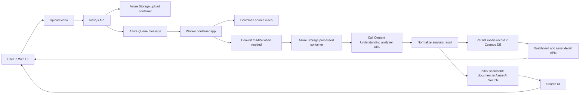
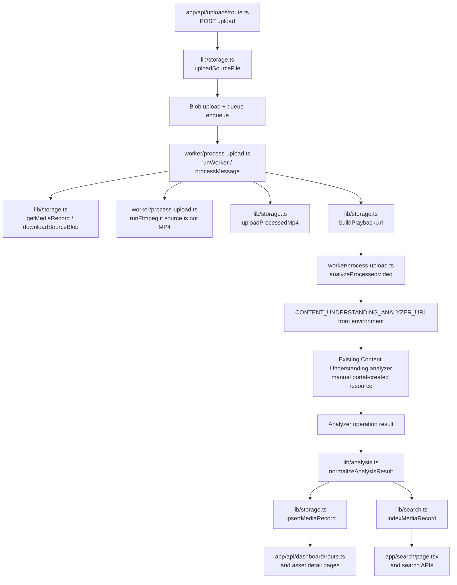

# Content Understanding Pipeline

A Next.js web application plus Azure worker pipeline for video upload, FFmpeg conversion, Content Understanding analysis, Cosmos persistence, and Azure AI Search indexing.

This repository is prepared for customer-facing deployment with these assumptions:

- Azure infrastructure is provisioned by Bicep.
- Azure AI Services / Foundry model deployments are provisioned by Bicep.
- The Content Understanding analyzer is created manually in the CU portal.
- The worker is given the analyzer URL through configuration and does not create or update analyzers.

## What Is Included

- Web dashboard for upload status, failure visibility, and asset detail views
- Upload API that writes source files to Blob Storage and queues work
- Worker that converts to MP4, calls Content Understanding, normalizes results, and indexes search
- Azure AI Search integration for lexical and vector search
- Bicep template for Storage, Queue, Cosmos DB, AI Search, AI Services / Foundry, Container Apps, Event Grid, Log Analytics, and Application Insights
- Portal-ready Content Understanding analyzer definition at [infra/content-understanding-analyzer.portal.json](infra/content-understanding-analyzer.portal.json)

## High-Level Solution Flow



## Detailed Code Path View



## Supported Scripts

Supported operational scripts in this repo:

- [scripts/build-and-deploy-images-from-outputs.ps1](scripts/build-and-deploy-images-from-outputs.ps1)
- [scripts/recreate-search-index.ps1](scripts/recreate-search-index.ps1)

The repository intentionally does not rely on environment-specific deployment helper scripts with hardcoded subscription, region, or resource group values.

## Prerequisites

For deployment and operations:

- Azure CLI 2.60+
- Bicep CLI via `az bicep`
- Node.js 20+
- npm 10+
- Git

For local application development:

- Node.js 20+
- npm 10+

For local worker execution outside Azure:

- FFmpeg available in `PATH`

## Required Azure Permissions

The deploying identity must be able to:

- create and update resource groups and resources in the target subscription/resource group
- create managed identities
- create Azure role assignments
- create Cosmos DB SQL role assignments

In practice, this usually means:

- `Contributor` on the target resource group or subscription
- `User Access Administrator` or `Owner` on the same scope so Bicep can create role assignments

For the manual Content Understanding analyzer creation step, the operator also needs portal access on the Azure AI Services account, such as:

- `Cognitive Services Contributor`
- `Owner`

## Runtime Configuration

### Required Application Settings

- `APP_BASE_URL` or `NEXT_PUBLIC_APP_BASE_URL`
- `NEXT_PUBLIC_APP_TITLE` optional, default `Content Understanding Hub`
- `AZURE_STORAGE_ACCOUNT_URL`
- `AZURE_STORAGE_UPLOAD_CONTAINER` optional, default `incoming-avi`
- `AZURE_STORAGE_PROCESSED_CONTAINER` optional, default `processed-mp4`
- `AZURE_STORAGE_QUEUE_NAME` optional, default `video-processing`
- `AZURE_COSMOS_ENDPOINT`
- `AZURE_COSMOS_DATABASE` optional, default `content-understanding`
- `AZURE_COSMOS_CONTAINER` optional, default `media-records`
- `CONTENT_UNDERSTANDING_ANALYZER_URL`
- `CONTENT_UNDERSTANDING_SCOPE` optional, default `https://cognitiveservices.azure.com/.default`
- `AZURE_AI_SEARCH_ENDPOINT`
- `AZURE_AI_SEARCH_INDEX_NAME` optional, default `content-understanding-assets`
- `AZURE_AI_SEARCH_API_VERSION` optional, default `2024-07-01`
- `AZURE_FOUNDRY_ENDPOINT`
- `AZURE_FOUNDRY_EMBEDDING_DEPLOYMENT` optional, default `text-embedding-3-large`
- `AZURE_FOUNDRY_EMBEDDING_API_VERSION` optional, default `2024-05-01-preview`
- `AZURE_FOUNDRY_EMBEDDING_DIMENSIONS` optional, default `1536`
- `AZURE_FOUNDRY_EMBEDDING_SCOPE` optional, default `https://cognitiveservices.azure.com/.default`

Optional:

- `ENTRA_ID_CLIENT_ID`
- `ENTRA_ID_CLIENT_SECRET`
- `ENTRA_ID_TENANT_ID`
- `AUTH_SESSION_SECRET`
- `APPLICATIONINSIGHTS_CONNECTION_STRING`
- `APPLICATIONINSIGHTS_ROLE_NAME`
- `CONTENT_UNDERSTANDING_MAX_POLLS` optional, default `40`
- `CONTENT_UNDERSTANDING_POLL_INTERVAL_MS` optional, default `5000`
- `UPLOAD_WRITE_QUEUE_MESSAGE` optional, default `false`
- `PLAYBACK_SAS_START_OFFSET_MINUTES` optional, default `5`
- `PLAYBACK_SAS_TTL_MINUTES` optional, default `60`
- `WORKER_POLL_INTERVAL_MS` optional, default `10000`
- `WORKER_QUEUE_VISIBILITY_TIMEOUT` optional, default `300`
- `WORKER_TMP_DIR` optional

## Content Understanding Analyzer

This repository does not provision or mutate the analyzer itself.

Use [infra/content-understanding-analyzer.portal.json](infra/content-understanding-analyzer.portal.json) as the import body when creating the analyzer in the Content Understanding portal.

Additional guidance is in [docs/content-understanding-analyzer.md](docs/content-understanding-analyzer.md).

After the analyzer exists, capture the analyzer URL in this form:

```text
https://<account>.services.ai.azure.com/contentunderstanding/analyzers/<analyzerName>?api-version=2025-11-01
```

Use that value for:

- the Bicep parameter `contentUnderstandingAnalyzerUrl`
- the worker container app setting `CONTENT_UNDERSTANDING_ANALYZER_URL`

## Deployment Overview

Recommended sequence:

1. Create a resource group.
2. Create an ACR.
3. Deploy infrastructure with Bicep using placeholder container images.
4. Create the Content Understanding analyzer manually in the CU portal using the included JSON.
5. Update the deployment or container app settings with the analyzer URL.
6. Build and roll out the real web and worker images using the image rollout script.
7. Upload a file and verify end-to-end processing.

## Bicep Deployment

### Important Parameters

Common required parameters:

- `location`
- `storageAccountName`
- `cosmosAccountName`
- `contentUnderstandingAccountName`
- `aiSearchServiceName`
- `webAppName`
- `containerAppName`
- `webContainerImage`
- `workerContainerImage`
- `containerRegistryName`
- `containerRegistryLoginServer`

Commonly important optional parameters:

- `cosmosLocation`
- `environmentName`
- `contentUnderstandingAnalyzerUrl`
- `foundryReasoningDeploymentName` default `gpt-5.2`
- `foundryCompletionDeploymentName` default `gpt-4.1-mini`
- `foundryEmbeddingDeploymentName` default `text-embedding-3-large`
- `existingContainerAppsVnetName`
- `existingContainerAppsSubnetName`
- `existingContainerAppsVnetResourceGroup`
- `containerAppsVnetName`
- `containerAppsVnetAddressPrefix`
- `containerAppsInfrastructureSubnetName`
- `containerAppsInfrastructureSubnetAddressPrefix`
- `authClientId`
- `authClientSecret`
- `authTenantId`
- `authSessionSecret`

### Example Deployment Variables

```powershell
$location = "southcentralus"
$suffix = Get-Date -Format "yyMMddHHmmss"

$resourceGroup = "content-understanding-$suffix"
$deploymentName = "content-understanding-bootstrap-$suffix"
$acrName = "cu${suffix}acr"
$storageAccountName = "cu${suffix}st"
$cosmosAccountName = "cu-$suffix-cosmos"
$contentUnderstandingAccountName = "cu-$suffix-content"
$searchServiceName = "cu-$suffix-search"
$webAppName = "cu-$suffix-web"
$workerAppName = "cu-$suffix-worker"
$environmentName = "cu-$suffix-env"

$cosmosLocation = "westus3"
$analyzerUrl = ""

$containerAppsVnetName = "vnet"
$containerAppsVnetAddressPrefix = "10.40.0.0/16"
$containerAppsInfrastructureSubnetName = "infra"
$containerAppsInfrastructureSubnetAddressPrefix = "10.40.0.0/23"

$authClientId = ""
$authClientSecret = ""
$authTenantId = ""
$authSessionSecret = ""
```

### Create Resource Group And ACR

```powershell
az login
az group create --name $resourceGroup --location $location

az acr create `
  --name $acrName `
  --resource-group $resourceGroup `
  --location $location `
  --sku Basic `
  --admin-enabled false

$acrLoginServer = az acr show --name $acrName --resource-group $resourceGroup --query loginServer -o tsv
```

### Deploy Infrastructure With Placeholder Images

```powershell
az deployment group create `
  --name $deploymentName `
  --resource-group $resourceGroup `
  --template-file infra/main.bicep `
  --parameters `
    location=$location `
    cosmosLocation=$cosmosLocation `
    environmentName=$environmentName `
    storageAccountName=$storageAccountName `
    cosmosAccountName=$cosmosAccountName `
    contentUnderstandingAccountName=$contentUnderstandingAccountName `
    aiSearchServiceName=$searchServiceName `
    webAppName=$webAppName `
    containerAppName=$workerAppName `
    webContainerImage='mcr.microsoft.com/azuredocs/containerapps-helloworld:latest' `
    workerContainerImage='mcr.microsoft.com/azuredocs/containerapps-helloworld:latest' `
    containerRegistryName=$acrName `
    containerRegistryLoginServer=$acrLoginServer `
    contentUnderstandingAnalyzerUrl=$analyzerUrl `
    containerAppsVnetName=$containerAppsVnetName `
    containerAppsVnetAddressPrefix=$containerAppsVnetAddressPrefix `
    containerAppsInfrastructureSubnetName=$containerAppsInfrastructureSubnetName `
    containerAppsInfrastructureSubnetAddressPrefix=$containerAppsInfrastructureSubnetAddressPrefix `
    authClientId=$authClientId `
    authClientSecret=$authClientSecret `
    authTenantId=$authTenantId `
    authSessionSecret=$authSessionSecret
```

If you are using an existing delegated subnet, pass:

- `existingContainerAppsVnetName`
- `existingContainerAppsSubnetName`
- `existingContainerAppsVnetResourceGroup`

and omit the new VNet/subnet parameters.

## Manual Content Understanding Step

After infrastructure deployment:

1. Open the provisioned Azure AI Services account in the Content Understanding portal.
2. Create or import an analyzer using [infra/content-understanding-analyzer.portal.json](infra/content-understanding-analyzer.portal.json).
3. Copy the analyzer URL.
4. Set `contentUnderstandingAnalyzerUrl` in a future Bicep deployment, or update `CONTENT_UNDERSTANDING_ANALYZER_URL` directly on the worker container app.

For long-term configuration hygiene, prefer setting the Bicep parameter so future deployments preserve the value.

## Build And Roll Out Application Images

After the bootstrap deployment exists, run:

```powershell
./scripts/build-and-deploy-images-from-outputs.ps1 -ResourceGroup $resourceGroup -DeploymentName $deploymentName
```

What it does:

- builds the web image in ACR
- builds the worker image in ACR
- updates both Container Apps to the new tags
- prints the active web endpoint and latest revisions

This script uses ACR build in Azure. Local Docker is not required.

## Verification Checklist

After rollout:

1. Confirm both container apps are `Running`.
2. Confirm the web app URL responds.
3. Confirm `CONTENT_UNDERSTANDING_ANALYZER_URL` is set on the worker.
4. Upload a video.
5. Confirm the asset moves through `uploaded`, `converting`, `analyzing`, `indexing`, and `completed`, or `failed` if analysis/transcoding fails.
6. Confirm search returns the newly indexed record.

Useful commands:

```powershell
az containerapp show -g $resourceGroup -n $webAppName --query "{state:properties.runningStatus,revision:properties.latestRevisionName,fqdn:properties.configuration.ingress.fqdn}" -o json

az containerapp show -g $resourceGroup -n $workerAppName --query "{state:properties.runningStatus,revision:properties.latestRevisionName}" -o json

az containerapp logs show -g $resourceGroup -n $workerAppName --tail 200 --format text
```

## Search Rebuild

If search is empty or you change index structure, rebuild the search index:

```powershell
./scripts/recreate-search-index.ps1 -ResourceGroup $resourceGroup -SearchServiceName $searchServiceName
```

## Local Development

Install dependencies:

```bash
npm install
```

Run the web app:

```bash
npm run dev
```

Run the worker locally:

```bash
npm run build:worker
npm run worker
```

The supported production path is Azure-backed. This repository no longer uses local demo persistence as a fallback for uploads and records.

## Security Notes

- Do not commit secrets.
- Use Azure Key Vault or Container App secret references where possible.
- `AUTH_SESSION_SECRET` is required whenever Entra ID authentication is enabled.
- The Bicep template assigns application identities to the resources they need. The deploying identity still needs permission to create those role assignments.
      existingContainerAppsVnetName=$existingContainerAppsVnetName `
      existingContainerAppsSubnetName=$existingContainerAppsSubnetName `
      existingContainerAppsVnetResourceGroup=$existingContainerAppsVnetResourceGroup `
      containerAppsVnetName=$containerAppsVnetName `
      containerAppsVnetAddressPrefix=$containerAppsVnetAddressPrefix `
      containerAppsInfrastructureSubnetName=$containerAppsInfrastructureSubnetName `
      containerAppsInfrastructureSubnetAddressPrefix=$containerAppsInfrastructureSubnetAddressPrefix `
      authClientId=$authClientId `
      authClientSecret=$authClientSecret `
      authTenantId=$authTenantId `
      authSessionSecret=$authSessionSecret
```

   Networking behavior:

   1. If `existingContainerAppsVnetName` and `existingContainerAppsSubnetName` are provided, the template uses that existing subnet.
   2. If either is empty, the template creates `containerAppsVnetName` and `containerAppsInfrastructureSubnetName` and delegates the subnet to `Microsoft.App/environments`.
   3. Web app ingress is public (`external: true`), worker has no public ingress.

### 5) Build images and update Container Apps via script

```powershell
./scripts/build-and-deploy-images-from-outputs.ps1 `
   -ResourceGroup $resourceGroup `
   -DeploymentName $deploymentName
```

What the script does:

1. reads deployment outputs to resolve ACR login server and Container App names
2. builds web and worker images with `az acr build`
3. updates both Container Apps to new tags
4. prints endpoint and deployed image references

### 6) Verify deployment

```powershell
az containerapp list -g $resourceGroup --query "[].{name:name,image:properties.template.containers[0].image,latestRevision:properties.latestRevisionName}" -o table

$webFqdn = az containerapp show -g $resourceGroup -n $webAppName --query properties.configuration.ingress.fqdn -o tsv
Write-Output "https://$webFqdn"
```

Optional system logs:

```powershell
az containerapp logs show -g $resourceGroup -n $webAppName --type system --tail 50
az containerapp logs show -g $resourceGroup -n $workerAppName --type system --tail 50
```

### 7) Recreate AI Search index (first deployment or schema reset)

```powershell
./scripts/recreate-search-index.ps1 -ResourceGroup $resourceGroup -SearchServiceName $searchServiceName
```

### 8) Validate app behavior

1. open the web URL
2. upload a test AVI file
3. verify worker processing logs
4. verify dashboard and search results

### 9) Cleanup

```powershell
az group delete --name $resourceGroup --yes --no-wait
```

## Deploy to Azure (manual-first)

### 1) Sign in and choose your subscription

```bash
az login
az account set --subscription "<subscription-id-or-name>"
```

### 2) Create resource group and container registry

```bash
az group create --name <resource-group> --location <location>
az acr create --name <acr-name> --resource-group <resource-group> --location <location> --sku Basic --admin-enabled false
az acr show --name <acr-name> --resource-group <resource-group> --query loginServer -o tsv
```

### 3) Build and push container images

```bash
az acr login --name <acr-name>
docker build -f Dockerfile.web -t <acr-login-server>/content-understanding-web:<tag> .
docker push <acr-login-server>/content-understanding-web:<tag>

docker build -f Dockerfile.worker -t <acr-login-server>/content-understanding-worker:<tag> .
docker push <acr-login-server>/content-understanding-worker:<tag>
```

### 4) Create deployment parameters

Copy and edit the example file:

```bash
cp infra/main.parameters.example.json infra/main.parameters.json
```

Set required values in `infra/main.parameters.json`:

- `storageAccountName`
- `cosmosAccountName`
- `contentUnderstandingAccountName`
- `webAppName`
- `webContainerImage`
- `workerContainerImage`
- `containerRegistryName`
- `containerRegistryLoginServer`

Optional auth values (recommended for production):

- `authClientId`
- `authClientSecret`
- `authTenantId`
- `authSessionSecret`

If auth values are empty, the app runs in demo sign-in mode.

Optional networking values:

- `existingContainerAppsVnetName`
- `existingContainerAppsSubnetName`
- `existingContainerAppsVnetResourceGroup`
- `containerAppsVnetName`
- `containerAppsVnetAddressPrefix`
- `containerAppsInfrastructureSubnetName`
- `containerAppsInfrastructureSubnetAddressPrefix`

If existing VNet/subnet values are provided, the template uses that subnet for the Container Apps environment. Otherwise, it creates a VNet and delegated infrastructure subnet.

### 5) Deploy infrastructure

```bash
az deployment group create \
   --name content-understanding-deploy \
   --resource-group <resource-group> \
   --template-file infra/main.bicep \
   --parameters @infra/main.parameters.json
```

Get the deployed app URL:

```bash
az deployment group show \
   --name content-understanding-deploy \
   --resource-group <resource-group> \
   --query properties.outputs.webAppUrl.value -o tsv
```

### 6) Create or refresh the Azure AI Search index

Run the included script after first deployment (and anytime you need to rebuild schema):

```powershell
./scripts/recreate-search-index.ps1 -ResourceGroup <resource-group> -SearchServiceName <ai-search-service-name>
```

### 7) Validate end-to-end

1. Open the deployed URL.
2. Upload a test AVI file.
3. Confirm worker activity in Container App logs.
4. Confirm processed records appear on dashboard and search page.

## Post-bootstrap image deployment script

If infrastructure was deployed with placeholder images, use this script to build and deploy real images without manually looking up ACR URL or container app names.

```powershell
./scripts/build-and-deploy-images-from-outputs.ps1 -ResourceGroup <resource-group>
```

Options:

- `-DeploymentName <name>` use a specific succeeded deployment (otherwise latest succeeded deployment in the resource group is used)
- `-ImageTag <tag>` set a custom tag (otherwise current UTC timestamp is used)
- `-WebImageName <name>` and `-WorkerImageName <name>` override repository names
- `-UseTrackedGitContext $false` disable the default tracked-files-only context mode
- `-NoWaitContainerAppUpdate $false` make `az containerapp update` synchronous (default is non-blocking)

Common usage examples:

```powershell
# Use latest succeeded deployment in the resource group
./scripts/build-and-deploy-images-from-outputs.ps1 -ResourceGroup <resource-group>

# Use a specific deployment and fixed image tag
./scripts/build-and-deploy-images-from-outputs.ps1 `
   -ResourceGroup <resource-group> `
   -DeploymentName <deployment-name> `
   -ImageTag 20260630120000

# Force synchronous container app updates
./scripts/build-and-deploy-images-from-outputs.ps1 `
   -ResourceGroup <resource-group> `
   -NoWaitContainerAppUpdate $false
```

By default, the script builds from a temporary Git-tracked-only context to avoid `az acr build` hanging on local tar packaging of large untracked files.

The script reads deployment outputs (`containerRegistryLoginServer`, `webContainerAppName`, `workerContainerAppName`) and then:

1. runs `az acr build` for web and worker images
2. updates both Container Apps to the new image tags
3. prints the final web endpoint

## Optional GitHub Actions deployment

Manual workflows are provided:

- `.github/workflows/deploy-test-environment.yml`
- `.github/workflows/destroy-test-environment.yml`

Required repository secrets:

- `AZURE_CLIENT_ID`
- `AZURE_TENANT_ID`
- `AZURE_SUBSCRIPTION_ID`

Optional app auth secrets:

- `APP_ENTRA_ID_CLIENT_ID`
- `APP_ENTRA_ID_CLIENT_SECRET`
- `APP_ENTRA_ID_TENANT_ID`
- `APP_AUTH_SESSION_SECRET`

If optional app auth secrets are omitted, workflow deployment uses demo sign-in mode.

## Troubleshooting

- Sign-in issues: verify Entra app redirect URI is `https://<your-host>/api/auth/callback` and all four auth env vars are set.
- Search returns no results: run `scripts/recreate-search-index.ps1`, then upload and process at least one file.
- Worker appears idle: verify queue name, storage URL, and worker logs.
- 403 errors to Azure resources: confirm managed identity role assignments completed successfully.

## Architecture

- Incoming AVI files are written to the upload blob container.
- Blob-created events are forwarded to Azure Queue Storage via Event Grid.
- The worker Container App scales on queue depth, converts AVI to MP4, and calls Content Understanding.
- The worker stores MP4 files and normalized analysis in Cosmos DB and Azure AI Search.
- The web app reads Cosmos DB and Search for dashboard, detail, and search experiences.
